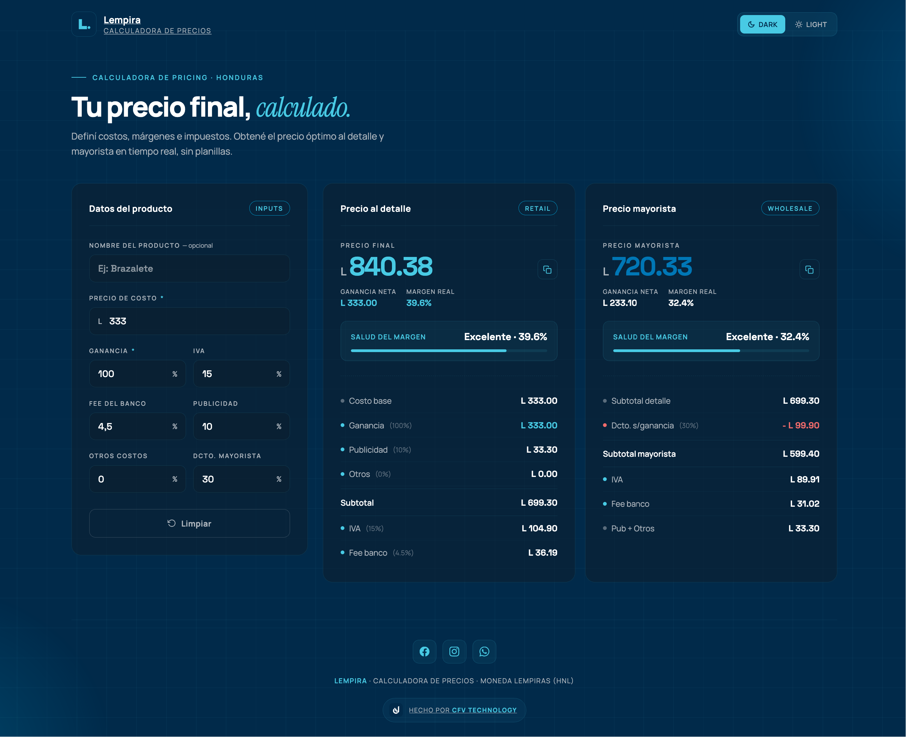

<p align="center">
  <picture>
    <source media="(prefers-color-scheme: dark)" srcset="./public/logo-readme.svg" />
    <source media="(prefers-color-scheme: light)" srcset="./public/logo-readme-light.svg" />
    
  </picture>
</p>

<h1 align="center">Lempira</h1>

<p align="center">
  <strong>Calculadora de precios gratuita para emprendedores hondureños.</strong><br />
  Definí costos, márgenes, IVA, comisiones e impuestos.<br />
  Obtené tu precio justo al detalle y mayorista en tiempo real.
</p>

<p align="center">
  <a href="https://lempira.cfv.technology"></a>
  
  
</p>

<p align="center">
  <sub>Hecha con 🧡 por <a href="https://cfv.technology"><strong>CFV Technology</strong></a> para la comunidad hondureña.</sub>
</p>

---

<p align="center">
  <picture>
    <source media="(prefers-color-scheme: dark)" srcset="./public/landing.png" />
    <source media="(prefers-color-scheme: light)" srcset="./public/landing-light.png" />
    
  </picture>
</p>

---

## Funcionalidades

- 🧮 Cálculo de precio **al detalle** y **mayorista** en Lempiras (HNL)
- 📊 Desglose detallado de cada componente del precio
- 💚 Indicador de salud del margen (Excelente / Saludable / Aceptable / Marginal / Pérdida)
- 📋 Copiar precio al portapapeles
- 🌗 Tema oscuro y claro
- 🔍 SEO completo: Open Graph, Twitter Cards, JSON-LD, sitemap

## Tech Stack

<p>
  
  
  
</p>

## Comandos

```bash
npm install       # Instalar dependencias
npm run dev       # Servidor de desarrollo → localhost:4321
npm run build     # Build de producción → ./dist/
npm run preview   # Previsualizar build
npx astro check   # Verificar tipos TypeScript
```

## Estructura

```
src/
  layouts/Layout.astro       # Layout base con meta tags SEO
  pages/index.astro          # Página principal de la calculadora
  styles/global.css          # Estilos globales (dark + light theme)
  scripts/calculator.ts      # Lógica de cálculo y UI
  components/                # Componentes Astro (header, footer, cards…)
public/
  logo-lempira.svg           # Logo principal (currentColor)
  logo-readme.svg            # Logo para README (dark mode)
  logo-readme-light.svg      # Logo para README (light mode)
  favicon.svg                # Favicon badge "L."
  logo-cfv-dark.svg          # Logo del creador (tema oscuro)
  logo-cfv-light.svg         # Logo del creador (tema claro)
  landing.png                # Screenshot dark mode
  landing-light.png          # Screenshot light mode
  robots.txt                 # Reglas de crawleo
```

## Valores por defecto (Honduras)

| Parámetro           | Valor  |
| :------------------ | :----- |
| Precio de costo     | L 333  |
| Ganancia            | 100%   |
| IVA                 | 15%    |
| Comisión bancaria   | 4.5%   |
| Publicidad          | 10%    |
| Otros costos        | 0%     |
| Descuento mayorista | 30%    |

> **Fuente de verdad:** `src/components/InputCard.astro`. Si cambiás un default, actualizá esta tabla.

## Contribuidores

<a href="https://github.com/celpoeta">
  
  <br />
  <sub><b>Caled Flores</b></sub>
</a>

## Licencia

MIT License — ver [LICENSE](LICENSE) para más detalles.

---

<p align="center">
  <sub><strong>Lempira</strong> — Calculá tu precio justo 🇭🇳</sub>
</p>
